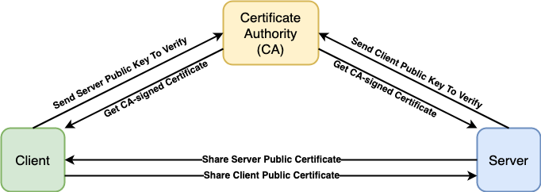

# Authentication

- [**TLS Authentication**]()
   - [**One-way TLS**]()
      - [**Server Code**]()
      - [**Client Code**]()
   - [**Two-way TLS (mTLS)**]()
      - [**Basic Flow**]()
      - [**Server Code**]()
      - [**Client Code**]()
- [**Other Authentication Solutions**]()
   - [**Basic Auth**]()
      - [**Server Code**]()
      - [**Client Code**]()
   - [**OAuth 2.0**]()
      - [**Server Code**]()
      - [**Client Code**]()
   - [**JWT**]()
      - [**Server Code**]()
      - [**Client Code**]()
   - [**Google Token-Based Authentication**]()

## TLS Authentication
### One-way TLS

- Only authenticate server identity.
- Only server shares public certificate.
#### Server Code
- Create a certificate object by parsing the pair of the server public certificate and the server private key.
  ```go
  cert, err := tls.LoadX509KeyPair("server.crt", "server.key")
  ```
- Add an server option to enable TLS for all incoming connections by adding certificates as TLS server credentials.
  ```go
  opts := []grpc.ServerOption{
      grpc.Creds(credentials.NewServerTLSFromCert(&cert)),
  }
  ```

#### Client Code
- Create a credential object by reading and parsing a public certificate.
  ```go
  creds, err := credentials.NewClientTLSFromFile("server.crt", "localhost")
  ```
- Add a dial option to include transport credentials.
  ```go
  opts := []grpc.DialOption{
      grpc.WithTransportCredentials(creds),
  }
  ```

### Two-way TLS (mTLS)

- Authenticate both server identity and client identity.
- Server and client share their public certificates with each other.

#### Basic Flow
- Client sends a request to access protected information from the server.
- The server sends its X.509 certificate to the client.
- Client validates the received certificate through a CA for CA-signed certificates.
- If the verification is successful, the client sends its certificate to the server.
- Server also verifies the client certificate through the CA.
- Once it is successful, the server gives permission to access protected data.

#### Server Code
- Create a certificate object by parsing the pair of the server public certificate and the server private key.
  ```go
  cert, err := tls.LoadX509KeyPair("server.crt", "server.key")
  ```
- Create a certificate pool.
  ```go
  certPool := x509.NewCertPool()
  ```
- Read and append the CA public certificate to the certificate pool.
  ```go
  ca, err := ioutil.ReadFile(caFile)
  certPool.AppendCertsFromPEM(ca)
  ```
- Add an server option to enable TLS for all incoming connections by creating TLS credentials.
  ```go
  opts := []grpc.ServerOption{
      grpc.Creds(
          credentials.NewTLS(&tls.Config {
              ClientAuth:   tls.RequireAndVerifyClientCert,
              Certificates: []tls.Certificate{cert},
              ClientCAs:    certPool,
          },
      )),
  }
  ```

#### Client Code
- Create a certificate object by parsing the pair of the client public certificate and the client private key.
  ```go
  cert, err := tls.LoadX509KeyPair("client.crt", "client.key")
  ```
- Read and append the CA public certificate to the certificate pool.
  ```go
  ca, err := ioutil.ReadFile(caFile)
  certPool.AppendCertsFromPEM(ca)
  ```
- Add a dial option to include transport credentials.
  ```go
  opts := []grpc.DialOption{
      grpc.WithTransportCredentials( credentials.NewTLS(&tls.Config{
          ServerName:   hostname,                // ServerName must be equal to the Common Name on the certificate.
          Certificates: []tls.Certificate{cert},
          RootCAs:      certPool,
      })),
  }
  ```
  
## Other Authentication Solutions
### Basic Authentication
- Use the user credentials (username and password) to authenticate.
- Request header: `Authorization: Basic YWRtaW46YWRtaW4=`
#### Server Code
#### Client Code

### OAuth 2.0
#### Server Code
#### Client Code

### JWT
#### Server Code
#### Client Code

### Google Token-Based Authentication
