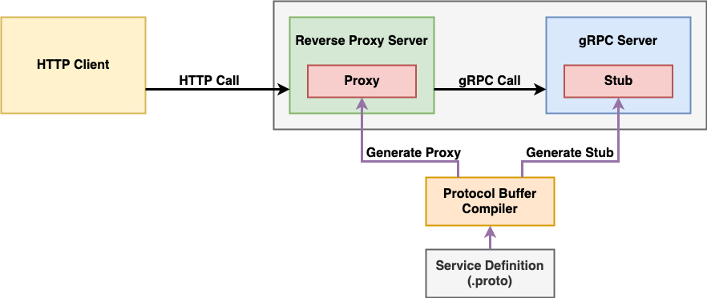

# gRPC Gateway

- [**Background**](#background)
- [**Installation**](#installation)
- [**Modify The Service Definition File (.proto)**](#modify-the-service-definition-file-proto)
- [**Generate Service Stub (.pb.go)**](#generate-service-stub-pbgo)
- [**Generate Reverse Proxy (.pb.gw.go)**](#generate-reverse-proxy-pbgwgo)
- [**Write gRPC Server Code**](#write-grpc-server-code)
- [**Write Reverse-Proxy Server Code**](#write-reverse-proxy-server-code)
- [**Build And Run gPRC Server and Reverse Proxy Server**](#build-and-run-gprc-server-and-reverse-proxy-server)
- [**Verify**](#verify)

## Background

- Add a reverse proxy server in front of gRPC server to expose RESTful JSON API for each remote method in the gRPC service and accept HTTP requests from REST clients.
- Provide the ability to invoke gRPC service in both gRPC and RESTful ways.
- The gRPC Gateway project can be found in [here](https://github.com/grpc-ecosystem/grpc-gateway).

## Installation
- Make sure the Protocol Buffer Compiler has been installed properly.
- Download some dependent packages
  ```bash
  go get -u github.com/grpc-ecosystem/grpc-gateway/protoc-gen-grpc-gateway
  go get -u github.com/grpc-ecosystem/grpc-gateway/protoc-gen-swagger
  go get -u github.com/golang/protobuf/protoc-gen-go
  ```
  
## Modify The Service Definition File (.proto)
- Example
  ```proto
  syntax = "proto3";

  import "google/protobuf/wrappers.proto";
  import "google/api/annotations.proto";

  package ecommerce;

  service ProductInfo {
      rpc addProduct(Product) returns (google.protobuf.StringValue) {
          option (google.api.http) = {
              post: "/v1/product"
              body: "*"
          };
      }
      rpc getProduct(google.protobuf.StringValue) returns (Product) {
          option (google.api.http) = {
              get:"/v1/product/{value}"
          };
      }
  }

  message Product {
      string id = 1;
      string name = 2;
      string description = 3;
      float price = 4;
  }
  ```
- Rules
   - Each mapping needs to specify a URL path template and an HTTP method.
   - The path template can contain one or more fields in the gRPC request message. But those fields should be nonrepeated fields with primitive types.
   - Any fields in the request message that are not in the path template automatically become HTTP query parameters if there is no HTTP request body.
   - Fields that are mapped to URL query parameters should be either a primitive type or a repeated primitive type or a nonrepeated message type.
   - For a repeated field type in query parameters, the parameter can be repeated in the URL.
     `...?param=A&param=B.`
   - For a message type in query parameters, each field of the message is mapped to a separate parameter.
     `...?foo.a=A&foo.b=B&foo.c=C`

## Generate Service Stub (.pb.go)
- Change directory to the base directory of the gRPC server (which has `main.go` for the gRPC server).
- Run the command.
  ```bash
  protoc -I <path_of_directory_storing_proto_file> <path_of_proto_file> \
  -I $GOPATH/src/github.com/grpc-ecosystem/grpc-gateway/third_party/googleapis \
  --go_out=plugins=grpc:<path_of_directory_where_you_want_to_generate_stub_file>
  ```
- It will generate the service stub `*.pb.go` in the target directory.

## Generate Reverse Proxy (.pb.gw.go)
- Change directory to the base directory of the reverse proxy server (which has `main.go` for the reverse proxy server).
- Run the command.
  ```bash
  protoc -I <path_of_directory_storing_proto_file> <path_of_proto_file> \
  -I $GOPATH/src/github.com/grpc-ecosystem/grpc-gateway/third_party/googleapis \
  --grpc-gateway_out=logtostderr=true:<path_of_directory_where_you_want_to_generate_stub_file>
  ```
- It will generate the reverse proxy stub `*.pb.gw.go` in the target directory.
- Copy the service stub (.pb.go) into the same directory of the reverse proxy stub (.pb.gw.go).

## Write gRPC Server Code
- Just write the code of the gRPC server as before. No special code change for gRPC gateway.
- The instruction can be found in [here](../docs/write_server.md).

## Write Reverse-Proxy Server Code
- The following code will connect to the gRPC server by port 50051 and open HTTP endpoint at port 8081.
  ```go
  package main

  import (
      "context"
      "log"
      "net/http"

      "github.com/grpc-ecosystem/grpc-gateway/runtime"
      "google.golang.org/grpc"

      gw "examples/grpc-gateway/reverse-proxy/ecommerce"
  )

  var (
      grpcServerEndpoint = "localhost:50051"
      reverseProxyPort = "8081"
  )

  func main() {
      ctx := context.Background()
      ctx, cancel := context.WithCancel(ctx)
      defer cancel()

      mux := runtime.NewServeMux()
      opts := []grpc.DialOption{grpc.WithInsecure()}
      err := gw.RegisterProductInfoHandlerFromEndpoint(ctx, mux, grpcServerEndpoint, opts)

      if err != nil {
          log.Fatalf("Fail to register gRPC gateway server endpoint: %v", err)
      }

      log.Printf("Starting gRPC gateway server on port " + reverseProxyPort)
      if err := http.ListenAndServe(":" + reverseProxyPort, mux); err != nil {
          log.Fatalf("Could not setup HTTP endpoint: %v", err)
      }
  }
  ```
  
## Build And Run gPRC Server and Reverse Proxy Server
- No special logic to build the executable file for the reverse proxy server.
- The instruction can be found in [here](../docs/build_executable.md).

## Verify
- **Test 1**
   - Method: `POST`
   - URL: `http://localhost:8081/v1/product`
   - Body:
     ```json
     {
       "name": "Apple", 
       "description": "iphone7", 
       "price": 699
     }
     ```
- **Test 2**
   - Method: `GET`
   - URL: `http://localhost:8081/v1/product/f7e2bc30-e51a-4840-a45a-0c5b676f58d4`
